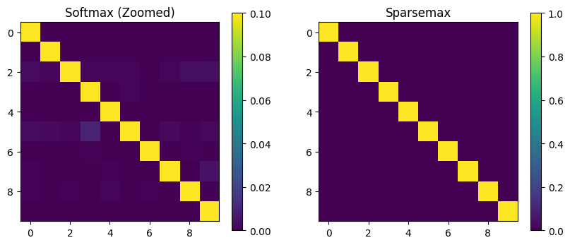

# transformer-sparsemax-attention

# Transformer Attention: Softmax vs Sparsemax

This project explores the effect of replacing Softmax with Sparsemax in the attention mechanism of Transformers.

## Key Results
- Softmax Sparsity: 0%
- Sparsemax Sparsity: ~88%
- Accuracy Drop: ~2–3%

## Key Insight
Softmax performs soft aggregation, while Sparsemax enforces hard selection, fundamentally changing attention behavior.

## Visual Results

## Files
- Transformer-SparseMax.ipynb → Implementation
- report.pdf → Detailed explanation

## Future Work
- Try Entmax
- Apply on real NLP datasets
